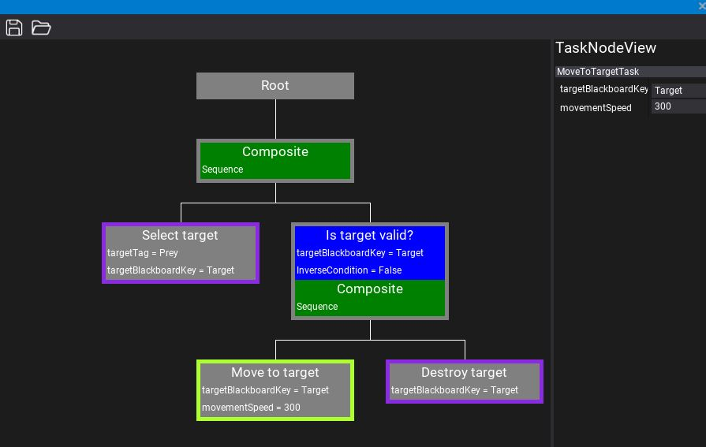

# FlaxEngineBehaviourTree

Behaviour tree system and editor, for Flax Engine.

## Features
- Load/Save behaviour tree to XML.
- Add custom tasks and decorators in C#.
- Create behaviour trees in visual editor.

## How to use
1. In the content folder (or subfolder): Right click and select "New" -> "Behaviour tree"
2. Create your behaviour tree in the visual editor. Right click on the root node to start adding child nodes. You can add decorators to composites the same way.
3. Click save to save your behaviour tree.
4. Add an "AI Controller" script to the object you want to be controlled by the behaviour tree.
5. Assign the behaviour tree in the "Behaviour Tree" field.

